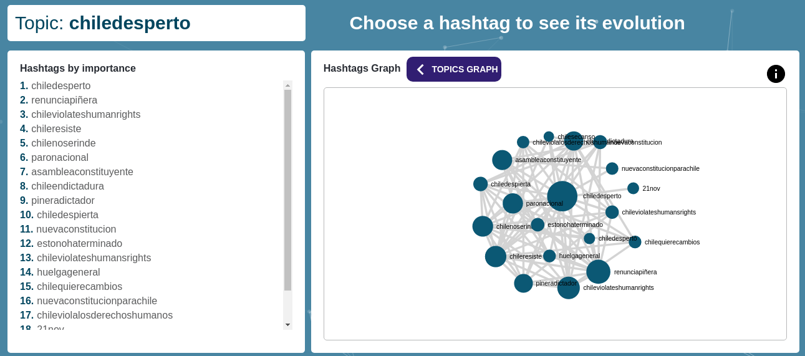
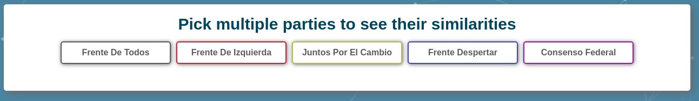
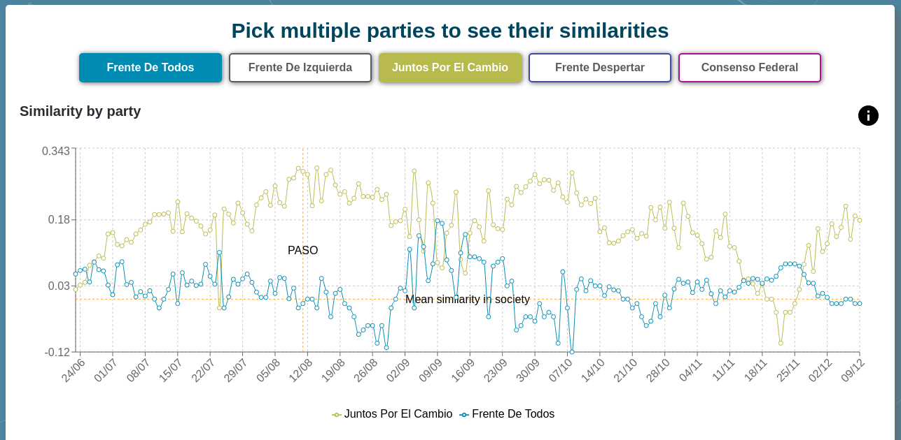
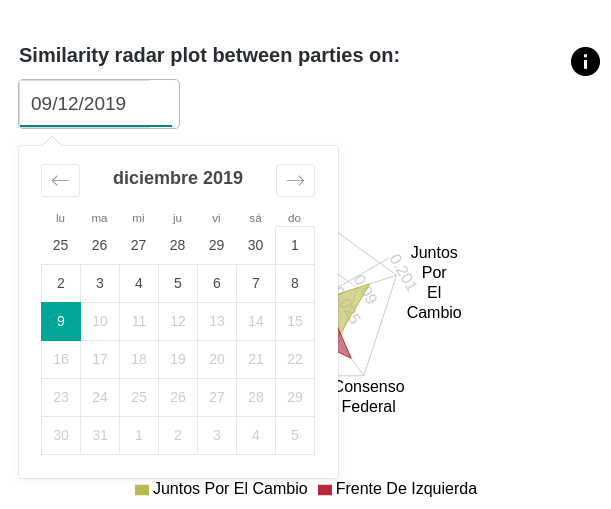
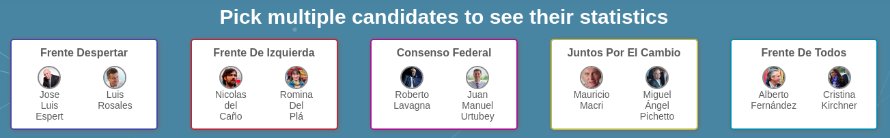
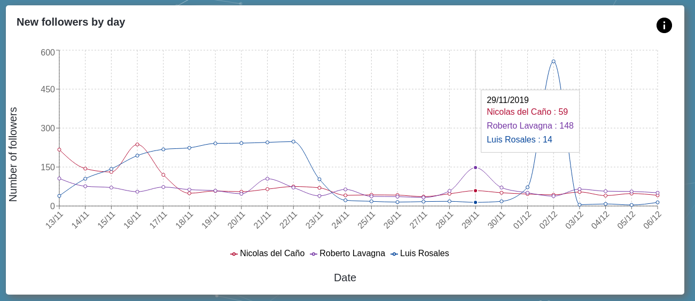
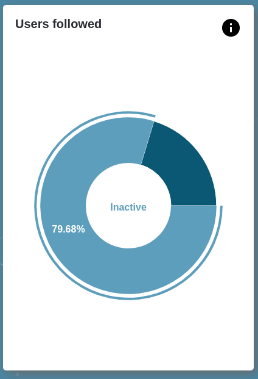
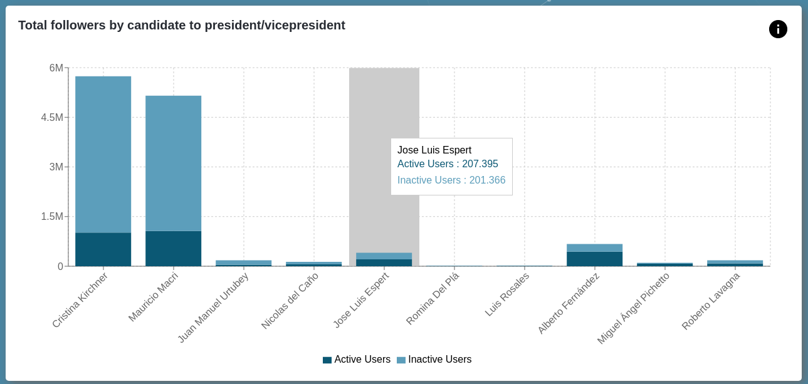

# Twitter: Argentinian Elections 2019
## Software Engineering Integral Final Work

This repository holds all the codebase for the Front End server and the Back End API used in the development of the
application found in http://elecciones2019.fi.uba.ar/.

All this code, as well as all the code you can find [here](https://github.com/facuguerrero/eleccionesBackEnd) was
designed, coded and tested by a team integrated by [Rodrigo De Rosa](https://github.com/RodrigoDeRosa),
[Facundo Guerrero](https://github.com/facuguerrero) and [Marcos Schapira](https://github.com/marcossch) in the context
of the Software Engineering integral final work at the University of Buenos Aires. In this readme, the basics of this
application will be explained as well as how to run it.

## What is this project about?

The point of this whole project was to analyze all the content posted on Twitter related to the Presidential elections
that took place in Argentina in 2019. The main idea was to identify how similar were the conversation topics the
supporters of each political party talked about and, with this, identify how similar each group was to the others.

To be able to make this analysis, it was needed to:

* Find our group of interest; this means whose tweets we would analyze.
* Determine which presidential candidate each of our users of interest supported.
* Get all the hashtags each of this users used.
* Find topics of conversation; this would be communities of nodes in a hashtag co occurrence graph.
* Analyze how common is the use of one or another topic of conversation for one or another support group (or political
party).
* Discover how related are the opinions of the different political parties by comparing how many conversation topics
they have in common.

## What does this repository host?

In this repository, you can find both the code for the Front End React application and for the Back End API server. It mainly works as a dashboard with multiple types of visualizations to help user analysis of the Argentinian presidential campaign. In
the following sections, we will talk about both of them.

### Front End React server

This application consumes the data generated from the [Back End API](#Back-End-API) and generates visualizations to help analyze qualitative and quantitative data and metrics.
Al visualizations are developed as generic React components which include filters, labels and interactions. This type of approach helped as adapt to the many varied visualizations we needed and work as agile as possible. They can be adapted to any particular graphic library, in this case we used [Recharts](https://recharts.org/en-US/).

Each part of the analysis required particular solutions. The following sections will display some of them organized by page, and the complete project can be found [here](http://elecciones2019.fi.uba.ar/)

#### Topics

Interactive and animated graph with layers and a secondary component to support mobile responsiveness as the graph resulted to be better appreciated in desktop view.

#### Parties

Interactive selection bar with randomized sort of elements for objectivity as it's a political analysis

Interactive radar chart with date selection integrated

#### Followers

Another type of an interactive selection bar with image support for the icons.

Interactive line chart adapted to animate when data updates occurred.

#### Activity

Interactive ring type chart.

Interactive Stacked bar chart.

### Back End API

To separate our processing application (which can be found [here](https://github.com/facuguerrero/eleccionesBackEnd))
from the Front End application related requests, we created a simple server that would simply get the created metrics
from the database and map them to a model the Front End application could easily display.

The code for this API server is [here](https://github.com/facuguerrero/eleccionesFrontEnd/tree/master/Mini-BackEnd) and
it is a Python Flask application running with [gUnicorn](https://gunicorn.org/) for a dynamic multiple worker
architecture in case we needed higher availability.

#### Endpoints

This server's endpoints were all designed to have the best possible experience while developing the Front End application;
we wanted it to received exactly the information it needed for display so that we would only need to worry about how
to show said data.

These endpoints were:

* `/candidates` returns information about how many new followers each candidate got every day since the start of our
analysis.
* `/topics` returns all the information for the display of a graph with the main topics of conversation and how they were
connected to each other.
* `/topics/<topic_id>` returns all the information for the display of a graph with the main hashtags of an specific
conversation topic and how they were connected to each other.
* `/dashboard` returns the home dashboard numbers; this is number of processed tweets, number of users analyzed, number
of hashtags found and number of conversation topics computed. Some of these values were calculated only once a day and
stored in order to make this particular response faster.
* `/hashtag_usage/<hashtag_name>` returns data about how many supporters of each party used an specific hashtag in a
certain window of time.
* `/topic_usage/<topic_id>` returns data about how many supporters of each party used at least one hashtag of an
specific conversation topic in a certain window of time.
* `/similarities` returns a report about similarities between the different party's support groups; a concept you can find
explained [here](https://github.com/facuguerrero/eleccionesBackEnd).
* `/party_relationships` returns information about how polarized the user network is; a concept you can also find
explained [here](https://github.com/facuguerrero/eleccionesBackEnd).
* `/<path:path>` would handle all wrong paths and return an exception.

## Deployment

This application was running in a server owned by the University of Buenos Aires and was deployed there using the
`deploy` script; there, we build and injected the static files so that the python back-end could serve them. The deployment was made manually via SCP due to university's restrictions.

#### How to run it locally

In order to run the server locally, first make sure you have installed:

* `Python 3.6`
* `mongo` running in the port 27017
* `gUnicorn`

Once that is ready, you can start the server by running `make prepare` and `make run` in the project's root. Be careful
to check the used port, as this server was directly serving from port `80` due to university's server requirements.
